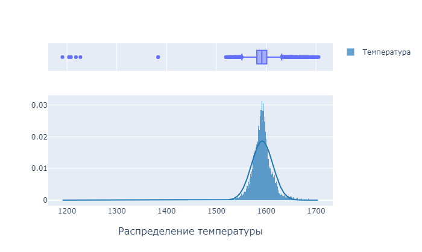

# Research project "Predict steel temperatures during smelting"

## Description
We need optimize a energy consumption while steel have smelting. The better way to achieve this aim to predict temperature of last measurement during produce steel.
We research data and several classes of machine learning in this Jupyter notebook. Choose the best model and make some feature analise.

## Stack:
* pandas
* plotly
* seanborn
* scikit-learn
* LightGBM
* CatBoost

## Main features
* Data analise

* Сorrelation matrix

* Feature importance

* Select best model

|                   Model                   |                     Parametrs                     | MAE_train | MAE_test |
|:-----------------------------------------:|:-------------------------------------------------:|:---------:|:--------:|
| Linear   regression                       | Ridge(alpha=14.0)                                 | 7.214013  | 7.120775 |
| LGBMRegressor   box                       | LGBMRegressor(metric='mae', random_state=42)      | 2.297391  | 5.834022 |
| LGBMRegressor   randomize search          | LGBMRegressor(learning_rate=0.5, max_depth=4, ... | 3.106434  | 6.246245 |
| CatBoost box                              | <catboost.core.CatBoostRegressor object at 0x0... | 2.345559  | 5.676636 |
| CatBoost   randomize search               | <catboost.core.CatBoostRegressor object at 0x0... | 4.198974  | 5.805898 |
| CatBoost final   (with feature selection) | <catboost.core.CatBoostRegressor object at 0x0... | 4.951184  | 5.859172 |

## Files
* [russian version](predict-orders-taxi-russian.ipynb)
* [russian html version](predict-orders-taxi-russian.ipynb)
* english version not ready
